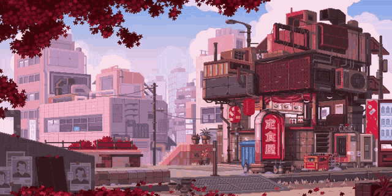

<h2>  Hi there 👋 </h2>

Here's a little about me:
<h2>
  I really like music 🎧
</h2>

<!-- Nothing weird to see here -->

  <a href="https://open.spotify.com/track/6kBrCet8H2BNoQwAQeo00d?si=65d4c275b5ea423c">
    <!-- Music bars move to the beat and are colored based on the track's happiness, danceability and energy! -->
      
    <!-- This is how you'd make the call dynamically  -->
  </a>

<h2> Languages and Tools 🧰 </h2>

       

<h2> My Passion & Goals ✨  </h2>

  I’m passionate about crafting clean, readable code that’s easy to understand and maintain. Problem-solving is my passion, I love diving into challenges and experiencing the thrill of finding elegant solutions.

  Right now, I’m sharpening my skills by working on a warehouse management system at a company, learning the ins and outs of building robust and scalable projects.

  I’m excited about the future and aiming to develop impactful web applications using Java or C#. Let’s build something amazing together! 🚀

  
   uwu <3

